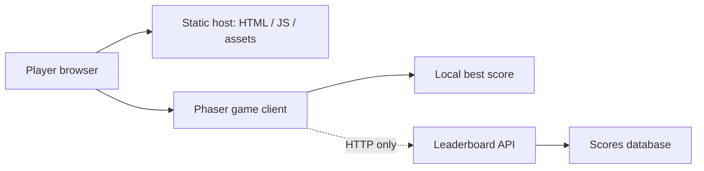

# 기술 아키텍처

## 1. 결론

게임 플레이 자체에는 별도 서버가 필요 없다. Vite가 만든 정적 HTML, JavaScript, CSS와 Phaser Canvas만으로 브라우저에서 완전히 실행할 수 있다.

서버가 필요한 기능은 후순위인 **글로벌 랭킹**뿐이다. 실시간 멀티플레이가 아니므로 게임 상태 동기화, 매치메이킹, WebSocket, 전용 게임 서버는 필요 없다. 핵심 게임과 제출 준비가 끝나기 전에는 서버를 구현하지 않는다.

개발 순서는 다음과 같다.

1. 클라이언트만으로 핵심 게임 완성
2. 로컬 최고점으로 전체 흐름 검증
3. 공개 배포, QA, 제출 필수 자료 준비
4. 시간이 남을 때만 작은 HTTP API와 DB를 추가해 글로벌 랭킹 연결

## 2. 기술 스택

- TypeScript: 게임 규칙과 데이터 계약의 오류를 일찍 발견
- Vite: 빠른 개발 서버와 정적 production 빌드
- Phaser 3.90: 성숙한 Canvas/WebGL, 입력, 오디오, Scene 수명주기
- Vitest: 점수, 타이머, spawn 규칙 같은 순수 로직 단위 테스트
- pnpm: 의존성 잠금과 재현 가능한 설치

Phaser 4가 현재 배포되어 있어도 이번 3일 프로젝트에서는 API와 사례가 축적된 Phaser 3.90을 선택한다. 새로운 엔진 기능보다 예측 가능한 구현을 우선한다.

React, 상태 관리 라이브러리, UI 컴포넌트 라이브러리는 사용하지 않는다. 게임은 캔버스와 최소 DOM으로 충분하다.

## 3. 전체 구조



중요한 경계:

- Static host가 게임 파일을 전달한다.
- Phaser client가 모든 실제 플레이를 담당한다.
- Leaderboard API는 점수 저장과 조회만 담당한다.
- API가 느리거나 실패해도 플레이와 재시작을 막지 않는다.

## 4. 저장소 구조

현재와 예정 구조는 다음과 같다. 필요해질 때만 하위 디렉터리를 추가한다.

```text
/
├─ AGENTS.md
├─ README.md
├─ docs/
├─ public/                  # 실제 정적 에셋이 생길 때 사용
├─ src/
│  ├─ main.ts
│  ├─ styles.css
│  └─ game/
│     ├─ config.ts
│     ├─ constants.ts
│     ├─ core/
│     │  ├─ math.ts
│     │  ├─ model.ts
│     │  ├─ random.ts
│     │  ├─ rules.ts
│     │  └─ simulation.ts
│     └─ scenes/
│        └─ BootScene.ts
├─ index.html
├─ package.json
├─ tsconfig.json
└─ pnpm-lock.yaml
```

핵심 루프 구현 시 다음 책임을 기준으로 파일을 나눈다. 파일이 하나뿐인 책임을 위해 빈 추상 계층을 미리 만들지는 않는다.

- Scene: 화면 상태와 Phaser 객체 수명주기
- Domain logic: 점수, 난이도, Context 수치 계산
- Systems: 여러 Scene 객체를 함께 갱신하는 동작이 실제로 생긴 경우
- Services: local storage와 leaderboard HTTP 통신

현재 core는 Phaser를 import하지 않는다. `stepGame`은 전달받은 state를 통제된 순서로 변경하지만 외부 I/O를 하지 않으며, 같은 seed·입력·고정 tick 수에는 같은 결과를 만든다.

## 5. 게임 상태

최소 상태 전이는 다음과 같다.

```text
Boot → Ready → Playing → Results
                 ↑          |
                 └── Retry ─┘
```

Scene을 상태마다 무조건 분리할 필요는 없다. 시작 화면과 결과 화면이 작다면 하나의 Play Scene 안에서 상태로 관리한다. 분리가 실제 복잡도를 낮출 때만 Scene을 추가한다.

## 6. 후순위 글로벌 랭킹 서버

이 절의 내용은 구현 예약이 아니라 시간이 남았을 때 사용할 설계 기준이다. 현재 클라이언트 개발을 막거나 폴더 구조를 늘리지 않는다.

### 필요한 이유

- 서로 다른 브라우저와 국가에서 같은 Top 10을 보기 위해 중앙 저장소가 필요하다.
- `localStorage`는 같은 브라우저의 개인 최고점만 저장할 수 있다.

### 필요하지 않은 것

- WebSocket
- 실시간 위치 동기화
- 방 생성과 매치메이킹
- 게임 서버의 프레임 단위 시뮬레이션
- 사용자 계정

### 랭킹을 구현할 때의 게스트 진입

- 첫 페이지 로드에서 `localStorage`에 게스트 정보가 없으면 임의 `guestId`와 `Guest-AB12` 형태의 표시명을 생성한다.
- 게스트 생성은 네트워크 응답을 기다리지 않으며 시작 버튼을 막지 않는다.
- 같은 브라우저에서는 로컬 데이터를 지우기 전까지 같은 게스트를 유지한다.
- 자유 닉네임 변경은 구현하지 않고 자동 생성 이름만 사용한다.
- `guestId`는 로그인 토큰이나 보안 자격 증명이 아니다. 서버는 run session과 점수 검사를 별도로 수행한다.
- 이메일, 비밀번호, OAuth, 복구 기능은 만들지 않는다.

### 최소 API 계약

공급자는 core gameplay 이후 정하되, 클라이언트가 기대하는 개념은 다음과 같다.

```text
POST /api/runs
  -> runId, seed, expiresAt

POST /api/scores
  <- runId, guestId, displayName, score, durationMs
  -> accepted, rank

GET /api/leaderboard?period=all-time&limit=10
  -> entries[]
```

`POST /api/runs`는 간단한 세션과 시작 시각을 제공한다. `POST /api/scores`는 최소한 실행 시간, 점수 상한, 중복 제출, 문자열 길이를 검사한다. 완전한 치트 방지는 MVP 목표가 아니다.

### 최소 데이터

```text
scores
- id
- guest_id
- display_name
- best_score
- duration_ms
- seed
- achieved_at
```

이메일, 실제 이름, 설치 앱, 브라우저 탭, 불필요한 개인정보를 저장하지 않는다. 같은 `guest_id`가 더 높은 점수를 제출했을 때만 기존 최고점을 갱신하며 공개 Top 10에는 게스트별 한 자리만 표시한다. 동점이면 먼저 달성한 점수를 우선한다.

### 공급자 선택 시점

core loop, 공개 배포, 브라우저 QA, 제출 필수 자료가 모두 준비된 뒤 시간이 남으면 결정한다. 후보는 하나의 serverless function과 관리형 DB를 제공하는 서비스다. 선택 기준은 다음 순서다.

1. 로그인 없이 게임 플레이 가능
2. 설정과 배포 시간이 짧음
3. 비밀키가 브라우저 bundle에 포함되지 않음
4. 무료 또는 매우 낮은 비용
5. 심사 기간 동안 안정적으로 접근 가능

서비스 계정이나 키가 필요한 시점에는 사용자에게 필요한 최소 설정만 요청한다.

## 7. 랭킹 실패 처리

- 게임 시작은 API 응답을 기다리지 않는다.
- 점수 제출은 결과 화면에서 비동기로 수행한다.
- 실패하면 점수와 run 정보를 브라우저에 잠시 보관하고 재시도 버튼을 보여준다.
- 조회 실패 시 로컬 최고점과 명확한 offline 상태를 보여준다.
- 오류가 게임 캔버스 전체를 멈추게 하지 않는다.

## 8. 성능 원칙

- 논리 해상도 1280×720, Phaser `FIT` 스케일을 사용한다.
- update에서 반복 생성되는 객체를 피한다.
- 토큰, 꼬리, 적 수에는 명시적 상한을 둔다.
- 충돌 판정은 처음에는 단순 거리 검사로 시작하고 필요할 때 공간 분할을 검토한다.
- 에셋은 브라우저 캐시가 가능한 정적 파일로 제공한다.
- 개발자 도구를 열지 않아도 오류 상태를 알 수 있게 한다.
- simulation은 60 Hz 고정 timestep으로만 전진한다. render delta는 100ms로 제한하고 한 frame에서 최대 6 tick만 처리한다.
- 탭 blur/hidden 동안 게임과 타이머를 멈추고 복귀 시 accumulator를 비운다.

## 9. 테스트 전략

### 자동 검사

- TypeScript typecheck
- 점수와 위험 배율 순수 함수 테스트
- Context 증가·COMPACT·피격 전이 테스트
- production build

### 브라우저 확인

- Chrome과 Edge 최신 버전
- 1280×720 및 작은 노트북 화면
- 마우스와 키보드
- 탭이 background로 갔다 돌아온 뒤 타이머 폭주 여부
- 랭킹을 구현한 경우의 API 연결 실패
- 재시작 후 이전 게임 객체와 입력 listener가 남지 않는지

## 10. 배포 원칙

- core game은 정적 호스팅에 배포할 수 있어야 한다.
- 공개 HTTPS URL은 로그인과 설치를 요구하지 않는다.
- production build의 source map과 환경 변수 노출을 확인한다.
- 제출 전 시크릿 창과 다른 네트워크에서 링크를 직접 확인한다.
